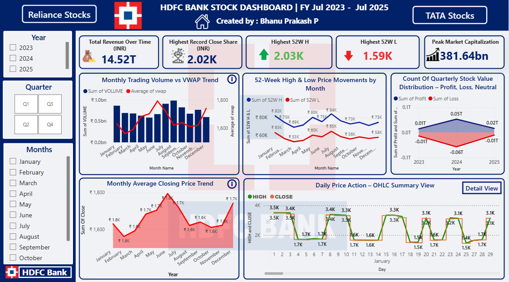
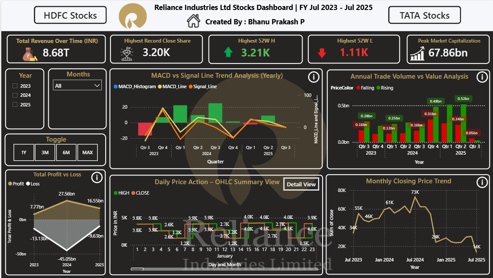
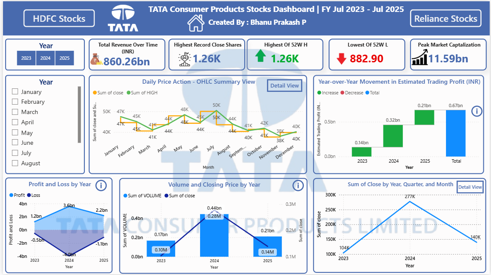

# 📊 Power BI Stock Performance Dashboard (2023–2025) 

### 👤 Created by: Bhanu Prakash Pepala  
**Role**: Aspiring Financial Data Analyst | 📍 India  
**Specialization**: Financial Dashboards, Stock Trend Analysis, Power BI, DAX  
🔗 [LinkedIn](https://www.linkedin.com/in/pepala-bhanu-prakash-2002m09d14/) | [GitHub](https://github.com/PepalaBhanuPrakash123)

---

## 🖼️ Dashboard Previews

### 📘 HDFC Bank – Stock Performance

### 📘 Reliance Industries – Stock Performance

### 📘 TATA Consumer – Stock Performance

### 📘 Overall Comparison Dashboard (2023–2025)

---

## 🔷 Project Overview

This Power BI dashboard provides a **strategic visual comparison** of stock performance for three major Indian companies:  
**TATA Consumer**, **Reliance Industries**, and **HDFC Bank**, covering the financial years **July 2023 to July 2025**.

It combines **technical indicators, profit analysis, revenue trends, and volume insights** into one **interactive, investor-focused dashboard**, ideal for institutional, retail, or business analyst use.

---

## 🎯 Business Objectives

- Compare stock behavior across companies and years  
- Identify top-performing years, volatility zones, and investor signals  
- Use technical indicators (MACD, RSI, VWAP) to interpret trading behavior  
- Deliver actionable insights for financial decision-making  

---

## 📁 Project Structure

| Page # | Title                        | Description |
|--------|------------------------------|-------------|
| 1️⃣ | Executive Overview              | High-level comparison of all 3 companies |
| 2️⃣ | Insights & Narration            | Written storytelling, KPIs, performance highlights |
| 3️⃣ | HDFC – Stock Analysis           | Volume, profit trends, RSI/MACD, OHLC |
| 4️⃣ | Reliance – Stock Analysis       | Turnover, volatility zones, breakout indicators |
| 5️⃣ | Tata – Stock Analysis           | Consistent growth, volume accumulation, low volatility |

---

## 📌 Key Features

- ✅ Smart Narrative Integration  
- ✅ Year & Company Slicers  
- ✅ RSI and MACD Indicators  
- ✅ Candlestick & OHLC Charts  
- ✅ Estimated Profit Analysis  
- ✅ Waterfall Charts for P&L  
- ✅ Volume vs VWAP Analysis  
- ✅ Technical storytelling with business implications  

---

## 📊 KPI Summary

| Company   | Total Revenue | Highest Close | Total Volume |
|-----------|---------------|----------------|---------------|
| HDFC      | ₹14.52T       | ₹2,020         | 9B shares     |
| Reliance  | ₹8.68T        | ₹3,200         | 4B shares     |
| TATA      | ₹860.26B      | ₹1,260         | 819M shares   |

---

## 🧠 Sample Business Insights

- **HDFC** leads in both **revenue and trading volume** → strong investor trust  
- **Reliance** holds the **highest share price** → premium valuation & speculative moves  
- **TATA** shows **low volatility, steady growth** → preferred for long-term portfolios  
- **2025** was HDFC's best profit year, while Reliance surged in 2024  
- **MACD & RSI** signals were strong indicators for entry points in HDFC & TATA

---

## 🛠️ Tools & Skills Used

- **Power BI** – Dashboard creation, interactivity, navigation  
- **DAX** – KPI calculations, dynamic filtering, smart insights  
- **Excel** – Data cleaning, structure optimization  
- **Financial Analysis** – Volume trends, MACD/RSI interpretation  
- **Data Storytelling** – KPI summaries, insights panel, narration layout  

---

## 🧾 How to Use

1. Open `.pbix` file in Power BI Desktop  
2. Navigate pages using the page tabs or buttons  
3. Use slicers (Year, Company, Month) to explore focused insights  
4. Hover over visuals for tooltips and narrative summaries  
5. Use Smart Narrative (Page 2) for instant AI-generated interpretation  

---

## 📘 About the Analyst

> “This project reflects my passion for turning raw stock data into actionable investment insights using Power BI, storytelling, and financial logic.”

- 💼 Aspiring Financial Data Analyst  
- 🧠 Focus: Equity Analysis, Visualization, Insights  
- 📈 Strong command of technical indicators and business KPIs  
- 🔗 [Connect on LinkedIn](https://www.linkedin.com/in/pepala-bhanu-prakash-2002m09d14/)

---

## 🌟 If you found this dashboard useful or insightful...

Please ⭐ the repo or share with recruiters/hiring managers interested in **Power BI + Finance Talent**!
