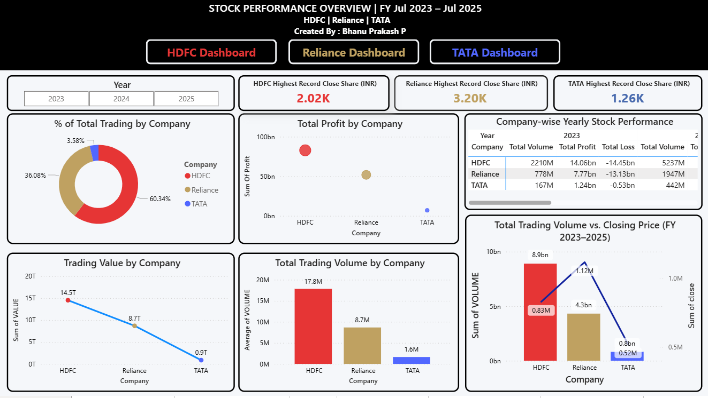

# 📊 Power BI Stock Performance Dashboard (2023–2025)

### 👤 Created by: Bhanu Prakash Pepala  
**Role**: Aspiring Financial Data Analyst | 📍 India  
**Specialization**: Financial Dashboards • Stock Trend Analysis • Power BI • DAX  
🔗 [LinkedIn](https://www.linkedin.com/in/pepala-bhanu-prakash-2002m09d14/) | [GitHub](https://github.com/PepalaBhanuPrakash123)

---

## 🖼️ Dashboard Previews

### 📘 Overall Comparison Dashboard (2023–2025)  

### 📘 HDFC Bank – Stock Performance  

### 📘 Reliance Industries – Stock Performance  

### 📘 Tata Consumer – Stock Performance  

---

## 🔷 Project Overview

This Power BI project delivers a **data-driven comparison** of stock performance for **HDFC Bank**, **Reliance Industries**, and **Tata Consumer** over the period **July 2023 to July 2025**.  

The dashboards include detailed technical and business analysis — ideal for **investors, analysts, and decision-makers**.

All visuals, DAX logic, and interpretations were built by me from scratch. I also **leveraged AI features like Smart Narrative** to enhance storytelling, demonstrating my ability to combine technical expertise with modern tools.

---

## 🎯 Business Objectives

- Analyze and compare stock performance across financial years and companies  
- Provide investors with visual indicators for profit, volume, and volatility  
- Use **technical signals** (MACD, RSI, VWAP) for smarter entry/exit analysis  
- Translate stock data into **clear business insights and decision triggers**

---

## 📁 Dashboard Structure

| Page  | Title                        | Focus Area |
|-------|------------------------------|------------|
| 1️⃣   | Company Comparison Dashboard | Cross-company KPI view & overview |
| 2️⃣   | Insight Narration Page       | Smart Narrative + Analyst Takeaways |
| 3️⃣   | HDFC Stock Dashboard         | Volume, profit, RSI/MACD, OHLC view |
| 4️⃣   | Reliance Stock Dashboard     | Turnover trends, price spikes, indicators |
| 5️⃣   | Tata Consumer Dashboard      | Steady growth, accumulation, long-hold view |

---

## 📌 Key Features

- ✅ Year, Company & Month Slicers for easy navigation  
- ✅ DAX-driven KPIs and trend logic   
- ✅ Candlestick, OHLC & Waterfall Charts  
- ✅ RSI and MACD technical indicators  
- ✅ Revenue, Volume & VWAP-based comparisons  
- ✅ KPI Cards, Buttons, and Modern UX

---

## 📊 KPI Summary

| Company   | Total Revenue | Highest Share Price | Total Volume |
|-----------|----------------|---------------------|--------------|
| HDFC      | ₹14.52 Trillion | ₹2,020              | 9B Shares    |
| Reliance  | ₹8.68 Trillion  | ₹3,200              | 4B Shares    |
| Tata      | ₹860.26 Billion | ₹1,260              | 819M Shares  |

---

## 🧠 Business Insights

- **HDFC** leads in both **revenue and volume**, signaling investor trust and long-term stability  
- **Reliance** shows **premium pricing and high volatility**, attractive for short-term traders  
- **Tata Consumer** reflects **low volatility with consistent growth**, perfect for long-hold portfolios  
- **2025** was HDFC’s peak performance year, while **Reliance surged in 2024**  
- **MACD & RSI** clearly indicated early breakout zones for both HDFC and Tata  

---

## 🛠️ Tools & Skills Used

- **Power BI** – Professional visuals, dashboard design, slicers & interactions  
- **DAX** – Calculated columns, measures, dynamic KPIs  
- **Excel** – Initial data prep, structure optimization  
- **Technical Analysis** – RSI, MACD, VWAP, OHLC modeling  
- **Smart Narrative** – Used for insights but not relied upon; full logic built manually  
- **Data Storytelling** – KPI design, insight generation, visual interpretation  

---

## 💬 AI + Human Intelligence

> “I leveraged AI tools like Power BI’s Smart Narrative to enhance storytelling in my dashboards. But all data modeling, visuals, logic, DAX insights and interpretations were personally built by me — because I believe in working smart and staying current with the latest tools.”

---

## 📘 About the Analyst

- 🎯 Aspiring Financial Data Analyst with a focus on **visual storytelling and investor logic**  
- 🧠 Strong command of **DAX**, **technical indicators**, and **business KPIs**  
- 💼 Passionate about turning raw financial data into **clear, actionable insights**

🔗 [Let’s Connect on LinkedIn](https://www.linkedin.com/in/pepala-bhanu-prakash-2002m09d14/)

---

## ⭐ Like This Work?

If you find this project impressive or helpful, please **🌟 star the repo** or share it with a **recruiter, manager, or fellow analyst** interested in **Power BI + Finance talent**.

---
